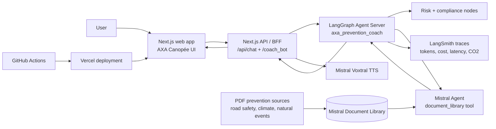

# AXA Prevention Coach

[](https://github.com/gfortaine/axa-prevention-coach/actions/workflows/ci.yml)

Independent interview prototype for an agentic prevention assistant: a
Next.js BFF and AXA-like UI connected to a Python LangGraph agent, Mistral
managed vector-store RAG, LangSmith observability and Mistral Voxtral
text-to-speech.

Live demo: <https://axa-prevention-coach.vercel.app>

> This repository is not affiliated with or endorsed by AXA. See [NOTICE](NOTICE).

## What is implemented



- **Agentic orchestration:** LangGraph graph with intent, retrieval, risk,
  generation, compliance and BFF formatting nodes.
- **RAG:** Mistral Document Library as the managed vector store, queried through
  a Mistral Agent `document_library` tool from a LangGraph node. There is no
  OpenAI/Qdrant/Ragie/Pinecone fallback for documentary answers.
- **BFF compatibility:** `/api/chat` and `/coach_bot` contracts for a web UI
  and reverse-engineered AXA-style surface.
- **Voice:** server-side Mistral Voxtral TTS streaming via `/api/tts/stream`.
- **Design system:** AXA France Canopée `prospect` tokens/components, with
  custom chat surfaces for fidelity to the public assistant behavior.
- **Observability:** LangSmith traces and lightweight FinOps/RSE metadata.
- **Interview support:** the current presentation deck is tracked as documentation at [`docs/AXA-Prevention-Coach-support.pptx`](docs/AXA-Prevention-Coach-support.pptx).

## Repository layout

```text
apps/web/          Next.js 16 / React 19 / TypeScript / AXA Canopée UI
services/agent/    Python LangGraph agent, corpus and seed script
docs/              Architecture, deployment, security, observability and ADRs
.github/workflows/ CI and optional Vercel deployment workflow
```

## AXA Lead Tech IA alignment

| Requirement area | Status | Evidence |
| --- | --- | --- |
| Python expertise | Implemented | `services/agent`, type hints, Ruff/Pyright/pytest gates |
| LangGraph / agentic systems | Implemented | Graph nodes in `services/agent/agent/graph.py` |
| RAG / vector store | Implemented | Mistral Document Library + Agent `document_library` tool |
| Microservice / REST BFF | Implemented | Next.js server routes, `/api/chat`, `/coach_bot`, TTS routes |
| CI/CD / clean code | Implemented | GitHub Actions, lint, typecheck, build, tests |
| Observability | Partial/demo | LangSmith traces + metadata; OTEL/Dynatrace documented roadmap |
| Guardrails | Partial/demo | source grounding and compliance node; policy engine is roadmap |
| Azure / Azure DevOps / OpenShift | Roadmap | target architecture documented, not claimed as deployed |
| Langfuse / MLflow / MCP / A2A | Roadmap | documented integration path, not part of current runtime |
| Squad leadership / platform strategy | Documentation | architecture docs, ADRs, roadmap and operating model |

## Quick start

### Web

```bash
cp apps/web/.env.example apps/web/.env.local
pnpm install
pnpm web:dev
```

Open <http://localhost:3000>.

The root `.env.example` is a single inventory of the shared variables; each
runtime still loads its component-local `.env` file.

### Agent

```bash
cd services/agent
cp .env.example .env
uv sync --group dev
uv run langgraph dev --no-browser
```

Create or reuse the Mistral Document Library and Agent:

```bash
export MISTRAL_API_KEY=...
uv run python scripts/mistral_library_admin.py --upload-corpus-documents --poll
uv run python scripts/mistral_library_admin.py --doctor
```

Set the printed `MISTRAL_LIBRARY_ID`, `MISTRAL_AGENT_ID` and
`MISTRAL_DOCUMENT_METADATA_PATH` values in the Agent Server environment. Runtime
retrieval is strict: if Mistral Document Library is missing or unavailable, the
graph returns an explicit unavailable state instead of using OpenAI or a local
fallback.

## Quality gates

```bash
pnpm run lint && pnpm run typecheck && pnpm run build
cd services/agent && uv run ruff check . && uv run ruff format --check . && uv run pyright && uv run pytest
```

## Documentation

- [Architecture](docs/architecture.md)
- [Deployment](docs/deployment.md)
- [Security](docs/security.md)
- [Observability](docs/observability.md)
- [Design system](docs/design-system.md)
- [Roadmap](docs/roadmap.md)
- [ADRs](docs/adr/)
