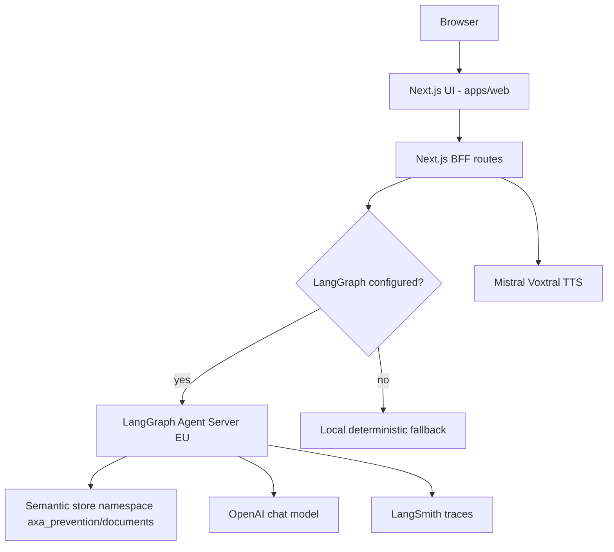

# Architecture

## Runtime view

## Agent graph

The Python agent is intentionally small and explicit:

1. `classify_intent`
2. `retrieve_context`
3. `score_risk`
4. `generate_answer`
5. `compliance_check`
6. `format_bff`

This mirrors a production agentic platform pattern while remaining readable for
an interview review.

## Enterprise target trajectory

The demo is not deployed on AXA infrastructure. The intended enterprise
trajectory is:

- Azure API Management or equivalent gateway in front of BFF/agent services.
- Azure OpenAI or approved model gateway for generation.
- Azure AI Search or Databricks Vector Search for governed RAG.
- OpenShift/Kubernetes for controlled runtime isolation.
- OAuth2/OIDC, managed identities and Key Vault for authentication/secrets.
- OpenTelemetry traces exported to Dynatrace and/or LangSmith/Langfuse.
- MLflow/evaluation pipeline for prompts, retrieval quality and model changes.

