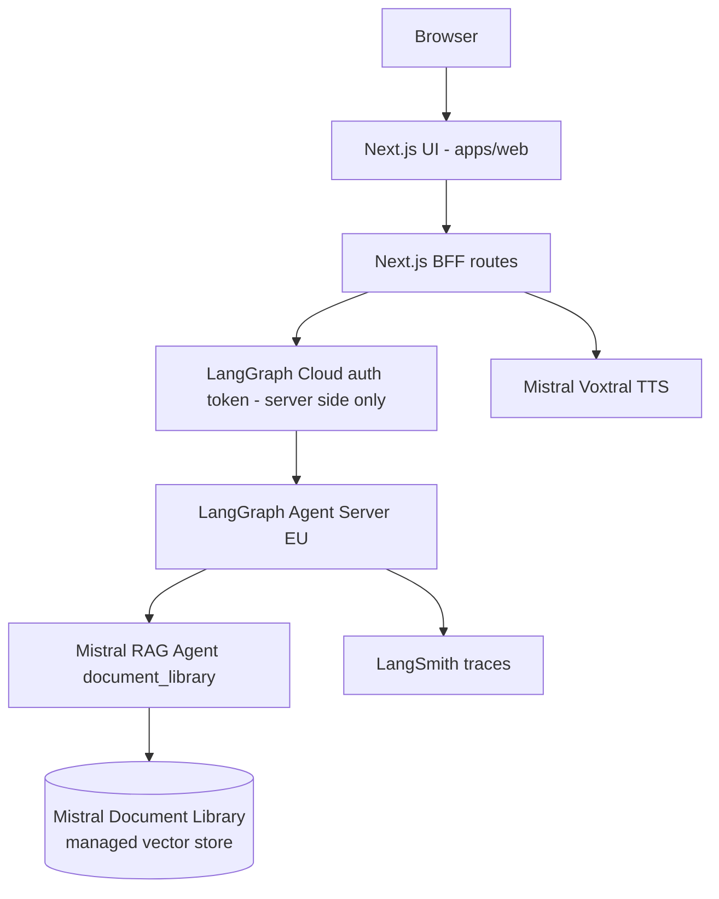

# Architecture

## Runtime view

The BFF does not expose LangGraph credentials to the browser. If LangGraph Cloud
is unavailable, `/api/chat` and `/coach_bot` return an explicit service error
instead of fabricating a local answer.

## Agent graph

The Python agent is intentionally small and explicit:

1. `classify_intent`
2. `retrieve_context`
3. `score_risk`
4. `generate_answer`
5. `compliance_check`
6. `format_bff`

This mirrors a production agentic platform pattern while remaining readable for
an interview review.

## RAG pipeline

The MVP uses Mistral Document Library via Mistral Agents API. Documentary
answers are Mistral-only: if the Mistral Library/Agent is missing or unavailable,
the graph returns an explicit unavailable state instead of falling back to
OpenAI, a local lexical answer, Qdrant, Ragie or Pinecone.

Mistral Document Library is the managed vector store. Mistral owns parsing,
chunking, embeddings, vector search and raw references. LangGraph/LangSmith own
the application control plane: routing, graph state, fail-closed behavior,
tracing/evals, and normalization into the stable web citation contract.

File ingestion is separate from retrieval:

1. Source manifest defines allowed documents, public URLs, display titles and
   domain tags.
2. `scripts/mistral_library_admin.py` creates/reuses a Mistral Library.
3. The script uploads PDF/DOCX/PPTX/TXT files to the Library and can poll
   processing status.
4. The script creates/reuses a Mistral Agent with the `document_library` tool.
5. The graph calls that single-purpose Mistral RAG Agent with `store=False`
   when supported and normalizes Mistral `tool_reference` / `reference` chunks
   into internal `/guide/<domain>?page=<n>` links.

Local corpus metadata remains useful only for stable titles, guide domains and
page links. It is not a fallback retriever.

This differs from a fully Mistral-native app such as
`antoine-palazz/use-case-design`: that reference lets Mistral Agents,
Conversations and handoffs own most orchestration. This repo keeps LangGraph as
the portfolio control plane and uses the Mistral Agent only as a managed RAG
appliance behind one graph node.

## Enterprise target trajectory

The demo is not deployed on AXA infrastructure. The intended enterprise
trajectory is:

- Azure API Management or equivalent gateway in front of BFF/agent services.
- Mistral or an AXA-approved model gateway for generation.
- Mistral Document Library or AXA-governed managed RAG for PDF retrieval.
- OpenShift/Kubernetes for controlled runtime isolation.
- OAuth2/OIDC, managed identities and Key Vault for authentication/secrets.
- OpenTelemetry traces exported to Dynatrace and/or LangSmith/Langfuse.
- MLflow/evaluation pipeline for prompts, retrieval quality and model changes.
