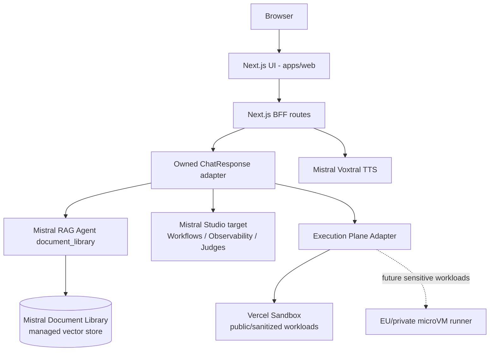

# Architecture

## Runtime view



The BFF does not expose Mistral credentials to the browser. It calls the
Mistral Conversations API server-side with the provisioned prevention Agent,
`store: false`, and an owned response contract. If Mistral Document Library is
unavailable, `/api/chat` and `/coach_bot` return an explicit unavailable state
instead of fabricating a local answer.

## Agent shape

The production MVP path is intentionally small and explicit:

1. validate and normalize the request in the Next.js BFF;
2. infer audience and deterministic risk signals;
3. call the Mistral Agent with the `document_library` tool;
4. normalize Mistral references into `/guide/<domain>?page=<n>` links;
5. return the stable `ChatResponse` contract.

`ChatResponse` separates product semantics from implementation diagnostics:
`status` and `grounding` describe whether the answer is source-grounded, while
`diagnostics.generation` and `diagnostics.retrieval` carry backend names for
technical review. The older `generationMode` and `retrieval.kind` fields remain
deprecated aliases for MVP compatibility.

The previous Python LangGraph graph remains in `services/agent` as reference
material while the strategic target moves to Mistral Workflows.

## Execution plane

Vercel Sandboxes add a missing primitive for agentic products: safe execution of
untrusted or AI-generated code. They run isolated Linux environments in
Firecracker microVMs with private filesystem, process and network isolation,
SDK/CLI control, package installs, exposed ports, and persistent snapshots.

They do **not** replace Mistral. The architecture split is:

| Concern | Owner |
| --- | --- |
| Reasoning, RAG, planning, eval hooks | Mistral Agents, Document Library, Workflows and Studio |
| Running untrusted code, tests, scripts and previews | Execution Plane Adapter |
| Public-demo/sanitized execution backend | Vercel Sandbox |
| Sensitive production execution backend | Future EU/private microVM runner |
| Durable artifacts | Product DB/object storage, not sandbox filesystem |

The canonical interface should remain provider-neutral:

```ts
interface AgentExecutionPlane {
  createSession(input: ExecutionSessionInput): Promise<ExecutionSession>;
  runCommand(sessionId: string, command: ExecutionCommand): Promise<ExecutionResult>;
  writeFiles(sessionId: string, files: ExecutionFile[]): Promise<void>;
  readFiles(sessionId: string, paths: string[]): Promise<ExecutionFile[]>;
  exposePort(sessionId: string, port: number): Promise<PreviewUrl>;
  stopSession(sessionId: string): Promise<ExecutionSnapshot>;
}
```

### Vercel Sandbox guardrails

Vercel Sandboxes are approved for public MVPs, synthetic/sanitized data,
portfolio demos, reproducible QA environments, and untrusted code execution that
does not receive sensitive user data or client documents.

They are **not** approved as the sovereign production execution plane for AXA or
Deskmate sensitive workloads while the official Sandbox region is only `iad1`.
For sensitive production use, keep the same adapter and replace the backend with
an EU/private runner such as Firecracker/Kata/gVisor on EU Kubernetes/OpenShift,
Azure Container Apps Jobs, or an AKS isolated runner.

Security and cost controls before any sandbox creation:

1. classify the input data and reject sensitive data by default;
2. require an explicit product/environment allow-list;
3. use short-lived scoped credentials or no credentials, never long-lived
   provider secrets;
4. set timeout, vCPU/memory and storage caps;
5. tag sessions with product, environment, user/session, trace ID and cost
   center;
6. restrict egress with firewall/domain allow-lists before production pilots;
7. call `stop()` explicitly and persist durable outputs outside the sandbox.

## RAG pipeline

The MVP uses Mistral Document Library via Mistral Agents API. Documentary
answers are Mistral-only: if the Mistral Library/Agent is missing or unavailable,
the BFF returns an explicit unavailable state instead of falling back to
OpenAI, a local lexical answer, Qdrant, Ragie or Pinecone.

Mistral Document Library is the managed vector store. Mistral owns parsing,
chunking, embeddings, vector search and raw references. The application owns
the public contract, trace IDs, fail-closed behavior, deterministic risk scoring
and normalization into the stable web citation contract.

File ingestion is separate from retrieval:

1. Source manifest defines allowed documents, public URLs, display titles and
   domain tags.
2. `scripts/mistral_library_admin.py` creates/reuses a Mistral Library.
3. The script uploads PDF/DOCX/PPTX/TXT files to the Library and can poll
   processing status.
4. The script creates/reuses a Mistral Agent with the `document_library` tool.
5. The BFF calls that single-purpose Mistral RAG Agent with `store=false`
   when supported and normalizes Mistral `tool_reference` / `reference` chunks
   into internal `/guide/<domain>?page=<n>` links.

Local corpus metadata remains useful only for stable titles, guide domains and
page links. It is not a fallback retriever.

This is close to a Mistral-native app such as `antoine-palazz/use-case-design`,
but the web contract, citation repair, product metadata and trace identifiers
remain owned by this application.

## Enterprise target trajectory

The demo is not deployed on AXA infrastructure. The intended enterprise
trajectory is:

- Azure API Management or equivalent gateway in front of BFF/agent services.
- Mistral or an AXA-approved model gateway for generation.
- Mistral Document Library or AXA-governed managed RAG for PDF retrieval.
- Mistral Workflows for durable multi-step processes once worker hosting and
  Studio entitlements are proven.
- Vercel Sandboxes for public/sanitized agentic execution, live previews and QA
  workbenches behind a provider-neutral Execution Plane Adapter.
- EU/private microVM runner for sensitive agentic execution when sovereignty
  requirements apply.
- OpenShift/Kubernetes for controlled runtime isolation.
- OAuth2/OIDC, managed identities and Key Vault for authentication/secrets.
- Mistral Studio Observability, Judges, Campaigns, Datasets and AI Registry as
  the default quality plane; OpenTelemetry/internal logs only where needed.
