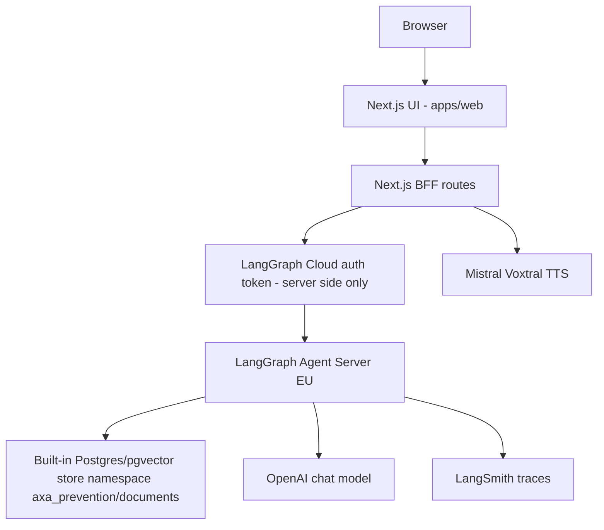

# Architecture

## Runtime view

The BFF does not expose LangGraph credentials to the browser. If LangGraph Cloud
is unavailable, `/api/chat` and `/coach_bot` return an explicit service error
instead of fabricating a local answer.

## Agent graph

The Python agent is intentionally small and explicit:

1. `classify_intent`
2. `retrieve_context`
3. `score_risk`
4. `generate_answer`
5. `compliance_check`
6. `format_bff`

This mirrors a production agentic platform pattern while remaining readable for
an interview review.

## RAG pipeline

The MVP uses LangSmith/LangGraph Agent Server semantic search on the built-in
Postgres-backed long-term store with pgvector. We do not use the alpha
`custom-store` path for the MVP because the built-in store already provides the
required persistence, semantic index and local/cloud parity. A custom store is a
future adapter if AXA requires controlled infrastructure, advanced ACL/tenancy,
hybrid ranking or strict residency.

File ingestion is separate from retrieval:

1. Source manifest defines allowed documents, public URLs, display titles and
   domain tags.
2. LiteParse parses PDFs/files locally and outputs structured page text/layout.
3. The ingestion adapter normalizes pages into canonical chunks with page,
   source, hash and domain metadata.
4. `scripts/seed_store.py` upserts chunks into namespace
   `("axa_prevention", "documents")`.
5. The graph retrieves with the Agent Server store and filters/reranks before
   grounded generation.

LiteParse is a parser, not a native LangChain PDF loader. Owning a small adapter
keeps downstream chunking and indexing independent from any parser-specific API.
At runtime, empty or unavailable semantic search produces an explicit retrieval
warning instead of a local lexical answer path.

## Enterprise target trajectory

The demo is not deployed on AXA infrastructure. The intended enterprise
trajectory is:

- Azure API Management or equivalent gateway in front of BFF/agent services.
- Azure OpenAI or approved model gateway for generation.
- Azure AI Search or Databricks Vector Search for governed RAG.
- OpenShift/Kubernetes for controlled runtime isolation.
- OAuth2/OIDC, managed identities and Key Vault for authentication/secrets.
- OpenTelemetry traces exported to Dynatrace and/or LangSmith/Langfuse.
- MLflow/evaluation pipeline for prompts, retrieval quality and model changes.
